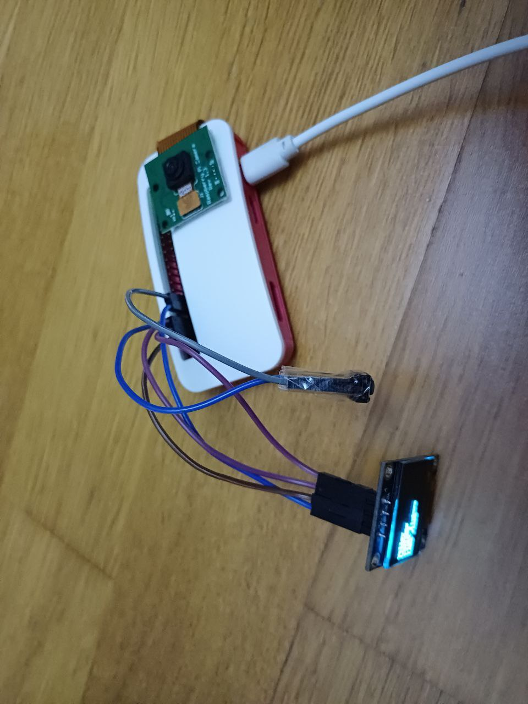

# Raspberry Pi Image Classification with GCP

Script to use Cloud Vision API in Cloud Run instance to send photo from Raspberry Pi to classify object.

Dependencies:
* luma.oled
* Google Cloud Run Instance
* Google Cloud Storage Bucket
* PIL
* RPi.GPIO
* requests

Components:
* Raspberry Pi Camera
* Button (GND -- GPIO17)
* SSD1306 I2C OLED (128x64) on I2C bus

## Pictures

I tested on Raspberry Pi Zero.

